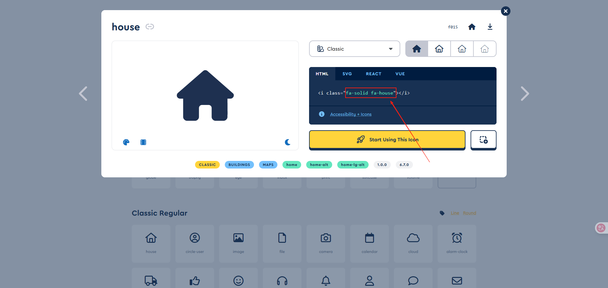
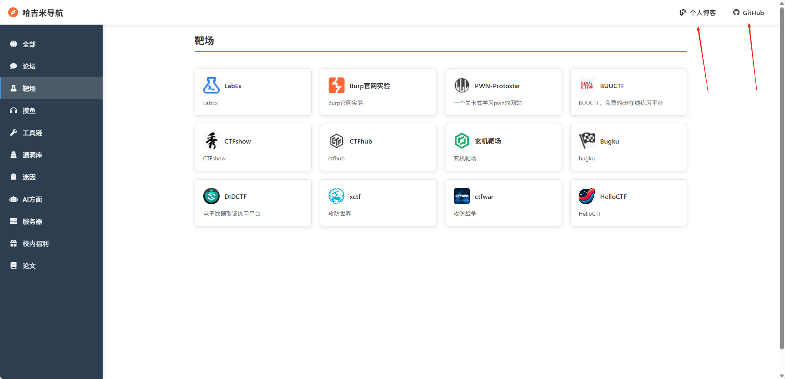

# 简单的导航页

一个完全静态的导航页，使用纯净的 HTML + CSS + JavaScript 开发，可直接部署到 GitHub Pages。

## 事件起因

本人的个人博客网站堆积了很多快捷链接门户，想要一个同样静态且不那么丑的导航页来放置这些东西。

但是看了一圈网上的，有一个做得挺好的，但是下载到本地访问之后发现极度卡，而且对于静态部署而言，添加方式也是很麻烦，没有类似的统一管理文件，而是自己去li里面改。

而其他做得好的又有后台管理，不太符合githubpages。

所以打算自己做一个简陋的，凑合用。


## 项目结构

```
MyNavPage/
├── index.html          # 主页面
├── favicon             # 站点icon
	└── favicon.ico      
├── css/
│   └── style.css      # 样式文件
├── js/
│   ├── data.js        # 网站数据配置
│   └── app.js         # JavaScript逻辑
├── icon/              # 图标文件夹
└── README.md          # 项目说明
```

## 快速开始

### 本地使用
由于是静态页面，所以直接下载修改即可。

直接在浏览器中打开 `index.html` 文件即可使用。

简单展示如下：


### 修改个性化

按道理来说仅仅需要修改data.js文件里的内容即可，实际html会根据这个文件的内容进行相应的渲染。

大体而言，

```js
const siteDataConfig = {
    "categories": [],
    "sites": []
};
```

#### 侧边栏修改

`categories`里面的内容是你要安排的大类个数及其属性，实际表现为侧边栏的内容。


新增或者删除需要填写id，name及其icon，其中第一个all建议不更改，然后icon可以到下面的网址去选择符合分类的icon


https://fontawesome.com/v6/icons#packs

将如下图所示的东西替换过去即可



#### 实际网址修改

```js
    {
      "id": "arxiv",
      "name": "arXiv",
      "url": "https://arxiv.org/",
      "description": "arxiv，预印本",
      "category": "papers",
      "icon": "icon/arxiv.png"
    },
```

其中某个链接如上，分别解释含义

- id，用于区分具体项，随便填都行
- name，用于在页面上进行展示的名称
- url，需要跳转的链接
- description，介绍，也是会在页面上展示
- category，所属类，会影响侧边栏点击之后的展示位置
- icon，具体图表存放的位置，可以png、svg、jpg、ico等


虽然我的一千多行很离谱，但是实际上正常人不会有这么多的，所以可以直接删掉data.js的大部分内容，更为简洁。


### 跳转链接更改

如下图所示的跳转链接也是可以修改的，直接在index.html更改即可



将href的相关内容更换为你的链接。

```html
<a href="https://folajj.github.io/" target="_blank" class="blog-link">
    <i class="fas fa-blog"></i>
    个人博客
</a>
<a href="https://github.com/FoLaJJ" target="_blank" class="github-link">
    <i class="fab fa-github"></i>
    GitHub
</a>
```

